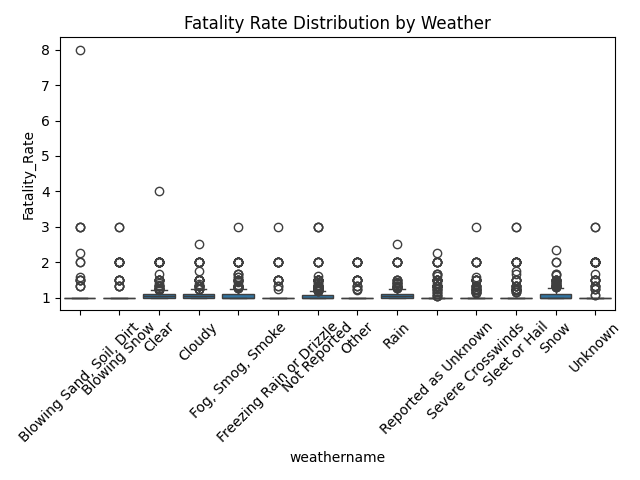
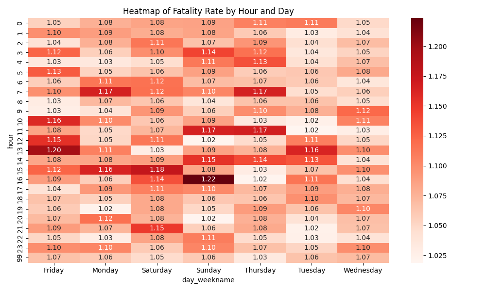

# Global Crash Data Pipeline & Risk Engine

## Overview
This repository contains an end-to-end geospatial data pipeline and predictive analytics backend designed to aggregate global traffic accident records and calculate dynamic, real-time risk scores for specific geographic locations.

Built with Python, R, and Node.js, the system ingests hundreds of millions of historical crash records from the United States, the United Kingdom, and South Africa. It normalizes this data into a centralized MySQL database and exposes a sophisticated FastAPI backend that uses spatial mathematics (Haversine formula) to identify high-risk traffic zones for pedestrians, cyclists, and drivers.

## System Architecture

The project is structured into three core domains:

1. **Data Acquisition Pipeline**  
   Scripts designed to fetch, clean, and normalize disparate government data sources into a unified structure.
2. **Backend Engine & API**  
   A high-performance FastAPI service that evaluates a given latitude/longitude coordinate and travel mode, returning a weighted danger score based on historical accident density and fatality rates.
3. **Data Analysis Dashboard**  
   Exploratory data analysis (EDA) tools and visual dashboards to discover correlations between lighting conditions, weather, time of day, and accident severity.

## Features & Implementation Details

### Data Acquisition
Handling large-scale, fragmented data requires robust engineering. This project features multithreaded fetching mechanisms and batch processing to build a 400MB+ normalized database.
* **NHTSA Pipeline (USA)**: Multi-threaded Python scripts utilizing `ThreadPoolExecutor` to handle API rate limits and extract detailed nested JSON records from the Fatality Analysis Reporting System (FARS).
* **Vision Zero (NYC)**: Automated extraction of spatial layers from ArcGIS MapServers, reconstructing geometry for thousands of localized accident records.
* **Stats19 (UK)**: Programmatic extraction using R to fetch and compile years of nationwide collision and casualty data.

### Predictive Spatial Algorithm
The core of the Alert System is a heavily optimized geographic querying engine:
* **Radius-Based Hotspot Detection**: The system converts a user-defined radius (in meters) into bounding box degrees to quickly filter candidate accidents from the MySQL database.
* **Context-Adaptive Grid Sizing**: Grid cells scale automatically depending on travel mode (e.g., 5-meter grids for pedestrians, 100-meter grids for cars).
* **Weighted Hotspot Scoring**: To prevent data fragmentation from falsely flagging minor accidents, the algorithm applies a strict 90th percentile threshold, weighting scores heavily toward recent accidents and high fatality rates. 

### Data Visualization & Exploratory Data Analysis (EDA)
Understanding the environmental factors leading to accidents is crucial. The repository includes an interactive dashboard and various correlation charts generated through Pandas and Seaborn.

**Fatality Rate vs Weather Conditions**  

**Accident Heatmap by Hour and Day**  

## Technical Stack
* **Languages**: Python, R, Node.js
* **Backend Frameworks**: FastAPI, Express
* **Database**: MySQL
* **Libraries**: Pandas, NumPy, Requests, Concurrent Futures, Seaborn, Matplotlib

## Repository Structure

* `Data_Acquisition/`: Scripts for retrieving raw data from NHTSA, Vision Zero, and Stats19.
* `Backend_and_Analytics/`: 
  * `Rule-Based-Alert-API/`: The FastAPI risk calculation engine.
  * `PushData-MySQL_DB/`: Scripts for batch-inserting CSV data into the SQL environment.
  * `Data_Analysis/`: Code for the analytics dashboard and correlation matrices.
* `Documentation/`: Whitepapers and mathematical specifications on algorithm improvements and data source evaluations.

## Author & Contact

**Abdul Rehman Rattu**
* Email: [rattu786.ar@gmail.com](mailto:rattu786.ar@gmail.com)
* LinkedIn: [Abdul Rehman Rattu](https://www.linkedin.com/in/abdul-rehman-rattu-395bba237)

If you have any questions regarding the implementation details, spatial analysis algorithms, or data pipelines, feel free to reach out.
